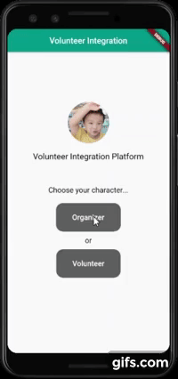
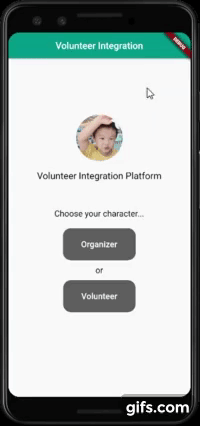
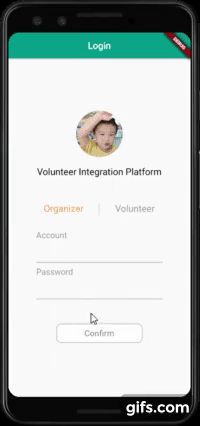
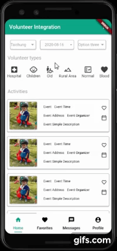

# Volunteer_integrationAPP

An app only used to practice laying out UI and contains some simple functions.
***

## Why choose this topic

The volunteer information is too scattered to be integrated.
Furthermore, people are always passive to receive the volunteer events, we might just get the information when we sometimes browse the internet or social media.

## Goal of this APP

Integrates the volunteer organization on one platform, making users not only receive the activities in real-time but also get more comprehensive information.

## UI progress rate

                              
